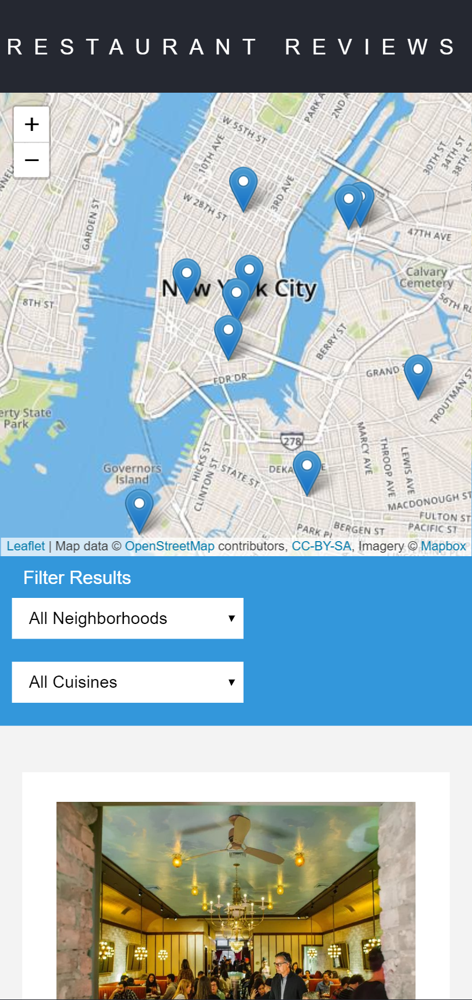

# Restaurant Reviews App - Udacity Front-End Developer Nanodegree Project.

## Project Overview

The goal of the project was to convert a static webpage to a mobile-ready web application.Convert a static design that lacks accessibility and convert the design to be responsive on different sized displays and accessible for screen reader use. Also add a service worker to begin the process of creating a seamless offline experience for the website users.The three required features were: responsive design, accessibility and offline use.

### Specification
I was provided with the code for a restaurant reviews website. This code had a lot of issues. It was barely usable on a desktop browser, much less a mobile device. It also didn’t include any standard accessibility features, and it didn't work offline at all. My job was to update the code to resolve these issues while still maintaining the included functionality. 

### How to run the application

In order to run the application you have some options:

1.Download as .zip file or clone this project:

2.$ git clone https://github.com/beingKHUSH/mws-restaurant-stage-1-master
In this folder, start up a simple HTTP server to serve up the site files on your local computer. Python has some simple tools to do this, and you don't even need to know Python. For most people, it's already installed on your computer.

3.In a terminal, check the version of Python you have: python -V. If you have Python 2.x, spin up the server with python -m SimpleHTTPServer 8000 (or some other port, if port 8000 is already in use.) For Python 3.x, you can use python3 -m http.server 8000. If you don't have Python installed, navigate to Python's website to download and install the software.

4.With your server running, visit the site: http://localhost:8000.

## Screenshot

#Desktop view

#Mobile view

## Leaflet.js and Mapbox:

This repository uses [leafletjs](https://leafletjs.com/) with [Mapbox](https://www.mapbox.com/). You need to replace `<your MAPBOX API KEY HERE>` with a token from [Mapbox](https://www.mapbox.com/). Mapbox is free to use, and does not require any payment information. 

### Note about ES6

Most of the code in this project has been written to the ES6 JavaScript specification for compatibility with modern web browsers and future proofing JavaScript code. As much as possible, try to maintain use of ES6 in any additional JavaScript you write. 

